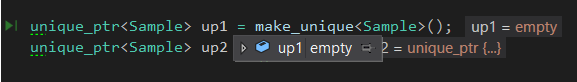

# C++ shared_ptr, unique_ptr a weak_ptr
Menší manuál k novým smart pointerům v C++ od verze C++11. Slouží k lepší obsluze paměti a zabraňují *memory leakům*. Bude řeč pouze o třech:

- shared_ptr<>
- unique_ptr<>
- weak_ptr<>

Všechny najdeme v knihovně *memory*, takže pro použití je nutné vložit:
```cpp
#include <memory>
```
## 1. shared_ptr<>
### 1.1 Inicializace
Syntax incializace například pro typ **int**:
```cpp
shared_ptr<int> sp (new int);
```
Vytvořili jsme nový pointer, který ukazuje na objekt (nebo proměnou) typu **int**.  Protože se **sp** chová jako pointer, pokud chceme k hodnotě přistupovat nebo ji měnit, musíme dereferencovat.
```cpp
*sp = 100;
cout << *sp;
```
Životnost **sp** (a dat na které ukazuje) je omezena blokem, kde se vyskytuje (*scope*).  Nemusíme volat free/delete abychom **sp** odstranili.

Jiný příklad s třídou **Sample**:
```cpp
class Sample {
public:
	Sample() { cout << "Sample Constructor" << endl; }
	~Sample() { cout << "Sample Destructor" << endl; }
	void publicFn() { cout << "This is public function of class" << endl; }
};
int main() {
	shared_ptr<Sample> sp(new Sample{});
	sp->publicFn();
	cout << "Print something"<<endl;
	return 0;
}
```
Zde je možné si všimnout způsobu přístupu k členským proměnným nebo k metodám třídy přes operátor **->**. Výsledek vytištěný na konzoli bude:
```
Sample Constructor
This is public function of class
Print something
Sample Destructor
```
Volání destruktoru probíhá až po ukončení programu. Jiný výsledek obdržíme při tomto zápisu:
```cpp
int main() {
	{
		shared_ptr<Sample> sp(new Sample{});
		sp->publicFn();	
	}
	cout << "Print something"<<endl;
	return 0;
}
```
Výsledek :
```
Sample Constructor
This is public function of class
Sample Destructor
Print something
```
Je vidět, že pointer opusil lokální blok a hned byl volán destruktor.

### 1.2 Vlastnictví a počet referencí
Důvodem názvu shared pointer je, že jeho vlastnictví se může měnit. Pokud přiřadíme paměť, na kterou pointer ukazuje jinému pointeru, tak i po vyjití původního pointeru z bloku bude pořád udržován v paměti, až do doby, kdy na tuto paměť nebude ukazovat už ani jeden poitner. 
Příklad, uvažujme stejnou třídu **Sample** a přidejme funkci, která vrací pointer v ní vytvořený:
```cpp
shared_ptr<Sample> Func() {
	cout << "Enter Function" << endl;
	shared_ptr<Sample> sp(new Sample{});
	cout << "Exit Function" << endl;
	cout << sp.use_count() << endl;
	return sp;
}

int main() {
	cout << "Enter Main" << endl << endl;
	Func();			//volání funkce, ale její návratová hodnota není použita
	cout << "----------"<<endl;
	shared_ptr<Sample> retSp = Func();
	shared_ptr<Sample> sp2 = retSp;		//vytvoření nového pointeru, který ukazuje na stejná data
	cout << retSp.use_count() << endl;
	cout << endl << "Exit Main" << endl;
	return 0;
}
```
Výsledek:
```
Enter Maing

Enter Function
Sample Constructor
Exit Function
1
Sample Destructor
----------
Enter Function
Sample Constructor
Exit Function
2

Exit Main
Sample Destructor
```
Je vidět, že první vytvořený objekt zanikne hned po vyjítí z těla funkce. Kdežto po přiřazení pointeru vytvořeného v těle funkce novému pointru v těle **main** , **retFp**, přetrvává jeho životnost až do konce programu (mějme na paměti, že pointer v těle funkce a v těle **main** odkazují na stejnou paměť). 

Použitá funkce ``.use_count() ``vrátí počet referencí, které ukazují na tu samou paměť.

### 1.3 Jiný způsob inicializace
Dosud byl nový objekt vytvářen klíčovým slovem **new**. Standard library má vestavěnou funkci ``make_shared<>()``, která funguje v podstatě stejně. Pokud jde o třídu, jejíž konstruktor obsahuje nějaké parametry, potom se vkládají do oblých závorek.

```cpp
class Sample {
	
public:
	Sample() { cout << "Sample Constructor" << endl; }
	~Sample() { cout << "Sample Destructor" << endl; }
	void publicFn() { cout << "This is public function of class" << endl; }
};
int main() {
	shared_ptr<Sample> sp = make_shared<Sample>();
	sp->publicFn();
	cout << "Print something"<<endl;
	return 0;
}
```

### 1.4 Použití s poli
Vytvoření pointeru, který ukazuje na pole je jednoduché, ukažme si rozdíly mezi *raw pointery* a *smart pointery*.

```cpp
int main() {
	int * rfield = new int[10];
	shared_ptr<int> sfield(new int[10]);
	return 0;
}
```
Důležté je ale pamatovat na správu paměti, kterou je nutné dělat ručně. Pokud bychom nezavolali destruktor, tak se zavolá defaultní, který vymaže pouze první prvek, tím pádem docílíme memory leaku.

Pro správné použití destruktoru musíme při inicializaci objektu nastavit i destruktor.
```cpp
int main() {
	shared_ptr<int> sfield(new int[10], default_delete<int[]>());
	return 0;
}
```
(Ponz.: ``shared_ptr<>`` pole nemůže být vytvořen pomocí  ``make_shared<>()``, protože není možné vždy poskytnout defaultní destruktor).

## 2. unique_ptr<>
### 2.1 Inicializace a správa paměti
Inicializace je velmi podobná jako u shared_ptr<>:
```cpp
class Sample {
public:
	Sample() { cout << "Sample Constuctor" << endl; }
	~Sample() { cout << "Sample Destructor" << endl; }
	void publicFn() { cout << "This is public function of class" << endl; }
};
int main() {
	unique_ptr<Sample> sp1(new Sample{});
	unique_ptr<Sample> sp2 = make_unique<Sample>();
	sp->publicFn();
	return 0;
}
```
Výsledek na konzoli:
```
Sample Constuctor
This is public function of class
Sample Destructor
```
Je vidět, že podobně jako u ``shared_ptr<> `` nemusíme volat destruktor, na konci bloku jeho platnosti se volá automaticky.

### 2.2 Rozdíl vlastnictví
Na rozdíl od ``shared_ptr<>``, na jehož paměť může ukazovat více pointerů, podstata ``unique_ptr<>`` je (jak je patrné z názvu) že jen on jediný může ukazovat na paměť, kterou spravuje. Při pokusu přiřadit tuto paměť jinému ``unique_ptr<>`` dojde ke kompilační chybě.
```cpp
int main() {
	unique_ptr<int> up1(new int);
	// This is not allowed and will give compilation error
	unique_ptr<int> up2 = up1;
	return 0;
}
```
### 2.3 Funkce ``move()`` - převedení vlastnictví na jiný pointer
Ve skutečnosti je možné převést vlastnictví spravované paměti na jiný pointer pomocí funkce ``move()``. Po provedení této operace se nový pointer stává jediným vlastníkem spravované paměti a předchozí se stává prázdným (doslova, viz obrázek ).
```cpp
int main() {
	unique_ptr<int> up1(new int);
	// After this line, up1 will no longer hold any reference to the
	// memory created. Its lifetime is owned by up2
	unique_ptr<int> up2 = move(up1);
	return 0;
}
```



Převedení vlastnictví lze provést také přes návratovou hodnotu funkce
```cpp
class Sample {
public:
	Sample() { cout << "Sample Constuctor" << endl; }
	~Sample() { cout << "Sample Destructor" << endl; }
};

unique_ptr<Sample> Func() {
	unique_ptr<Sample> up(new Sample{});
	return up;
}

int main() {
	unique_ptr<Sample> retup = Func();
	return 0;
}
```
Na první pohled se zdá, že je zde porušen zákaz převádění vlastnictví ale ve skutečnosti kompilátor explicitně nahradí kód ve funkci ``Func()`` tímto způsobem:
```cpp
unique_ptr<Sample> Func() {
	unique_ptr<Sample> up(new Sample{});
	return move(up);
}
```
***
Na rozdíl od ``shared_ptr<>`` lze vytvořit pole pomocí ``make_unique<>()`` bez problémů. Pokud jde o uživatelem vytvořené třídy, je třeba implementovat příslušný destruktor, který je volán automaticky při destrukci pointeru.
```cpp
unique_ptr<A[]> sp = make_unique<A[]>(10);
```

## 3. weak_ptr<>
### 3.1 Syntax a použití
U ``weak_ptr<>`` máme stejnou syntaxi jako u ostatních
```cpp
weak_ptr<T> wp = sp; 	//other smart pointer
```
Na rozdíl od ostatních smart pointerů ``unique_ptr<>`` a ``shared_ptr<>`` nepřebírá vlastnictví objektu a ani se nepřipočítává reference count.

Příklad:
```cpp
class Sample {
public:
	Sample() { cout << "Consructor" << endl; }
	~Sample() { cout << "Destructor" << endl; }
};

int main() {
	shared_ptr<Sample> sp = make_shared<Sample>();
	cout << sp.use_count() << endl; // Prints 1
	weak_ptr<Sample> wp = sp;
	cout << sp.use_count() << endl; // Still Prints 1
	return 0;
}
```
### 3.2 Použítí ``weak_ptr<>``
Protože ``weak_ptr<>`` nepřebírá vlastnictví objektu, je vhodné ho použít v takovém případě, když nepotřebujeme spravovat vlastnictví objektu, na který ukazuje. ``weak_ptr<>`` obsahuje několik metod, ze kterých se můžeme dozvědět, zda je pointer stále platný, kdo je jeho majitelem a jiné funkce.

Příklad, použití třídy ``Sample``:

```cpp
weak_ptr<Sample> func() {
	shared_ptr<Sample> Sp = make_shared<Sample>();
	return Sp;
}

int main() {
	weak_ptr<Sample> Wp = func();
	cout << "End of Main" << endl;
	return 0;
}
```
Výpis na konzoli bude následující:
```
Constructor
Destructor
End of Main
```
Je vidět, že ``weak_ptr<>`` nepřebírá vlastnictví objektu vráceného parametrem funkce, takže jeho platnost hned zaniká při opuštění těla funkce.